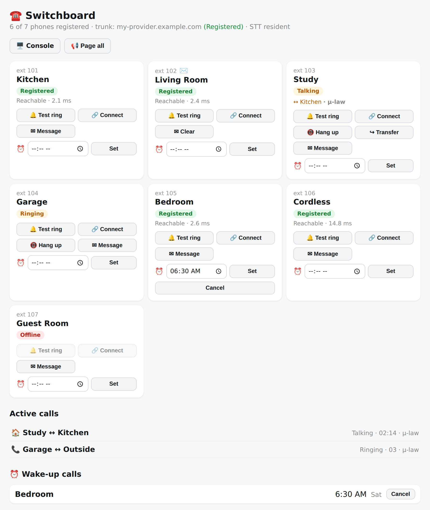
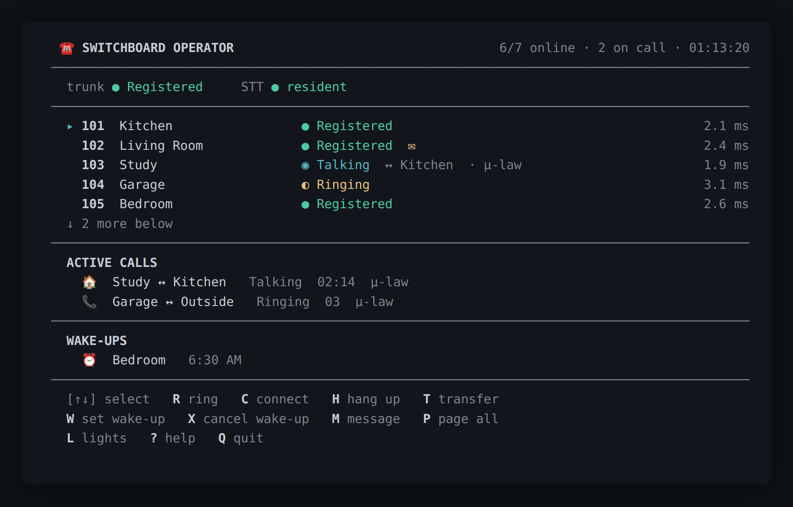

# Switchboard

A self-hosted **Asterisk 20 + PJSIP** phone system for the analog phones in your
home, packaged as a Home Assistant add-on. Each FXS port on a **Grandstream
GXW4216 V2** gateway becomes a room extension; every phone can call every other
phone, reach a set of on-box voice features, and — optionally — an outside line
over a SIP trunk. Audio is **G.711 µ-law end to end** — no transcoding, no HD/Opus.

This document is the complete reference. For the security model and the accepted
LAN-local risks, see **[SECURITY.md](SECURITY.md)**.

**Contents**

1. [Quick start](#1-quick-start)
2. [Configuration reference](#2-configuration-reference)
3. [Extensions & feature codes](#3-extensions--feature-codes)
4. [The voice operator & directory](#4-the-voice-operator--directory-assistance)
5. [Wake-up calls & the talking clock](#5-wake-up-calls--the-talking-clock)
6. [Paging & announcements](#6-paging--announcements)
7. [Grandstream GXW4216 V2 provisioning](#7-grandstream-gxw4216-v2-provisioning)
8. [The WP826 WiFi cordless](#8-the-wp826-wifi-cordless-optional)
9. [Adding an outside line (SIP trunk)](#9-adding-an-outside-line-sip-trunk)
10. [The operator console](#10-the-operator-console-telnet--browser)
11. [Health monitoring & Home Assistant sensors](#11-health-monitoring--home-assistant-sensors)
12. [How it's built](#12-how-its-built)
13. [Codecs — G.711 µ-law only, on purpose](#13-codecs--g711-µ-law-only-on-purpose)
14. [Troubleshooting](#14-troubleshooting)
15. [Security](#15-security)
16. [Reproducing on new hardware](#16-reproducing-on-new-hardware)

---

## 1. Quick start

1. **Install** the add-on (you already did if you're reading this from the add-on's
   Documentation tab).
2. Open the **Configuration** tab and define one entry under `rooms` per phone,
   each with a unique extension, a friendly name, and a **secret** (the password
   the Grandstream port will use to register). **Replace the `change-me-…`
   placeholder secrets.**
3. **Start** the add-on. Watch the **Log** tab; you should see
   `switchboard-config` render the configuration (look for
   `codecs: u-law only (no transcoding)` near the end, closing with
   `done: N room(s), trunk=…`), then Asterisk start.
4. **Provision the gateway** ([§7](#7-grandstream-gxw4216-v2-provisioning)) so
   each FXS port registers.
5. Open the **Switchboard** panel in the Home Assistant sidebar (Ingress) — each
   room flips to **Registered** as its port comes online.
6. Pick up a phone and dial another room's extension. Done.



The dashboard also carries a **Lights panel**: every Home Assistant light the add-on can see, grouped by area, with on/off toggles — the same control the voice menu on `43` offers, for when you would rather tap than talk.

Changing options and restarting the add-on regenerates the entire Asterisk
configuration — **the add-on options are the source of truth.** Editing
`/etc/asterisk/*.conf` by hand is pointless; every file is overwritten on start.

---

## 2. Configuration reference

Every option below appears in the **Configuration** tab with a friendly label and
inline help. Defaults are shown. A value is *optional* unless noted; leaving it at
its default is fine.

### Core

| Option | Default | Notes |
|--------|---------|-------|
| `log_level` | `info` | `trace \| debug \| info \| notice \| warning \| error \| critical` — but only **three** of the seven behave differently. The Asterisk console channel always carries `notice,warning,error`; `info` adds `verbose`; `debug` and `trace` add `verbose` **and** `debug` and are identical to each other. `notice`, `warning`, `error` and `critical` all produce the same bare `notice,warning,error` — this is not a severity filter, so picking `error` does *not* silence notices. Drop to `debug` to diagnose, then set back (it is very noisy). The durable `/data/state/asterisk.log` copy stays at `notice,warning,error` whatever you pick. |
| `rtp_start` | `10000` | First UDP port for live call audio (RTP). Must be below `rtp_end`. |
| `rtp_end` | `10200` | Last RTP port. The default 200-port window is far more than a home needs (~2 ports per call). |

### Rooms (the phones)

| Option | Default | Notes |
|--------|---------|-------|
| `rooms` | 2 placeholders | A list; one entry per handset. Each has `ext` (2–6 digits, unique), `name` (shown in the directory/operator/dashboard), and `secret` (the SIP password — **change it from the default**). The shipped defaults are `101 Kitchen` / `102 Living Room` with `change-me-…` secrets. |

### Voice operator & speech

| Option | Default | Notes |
|--------|---------|-------|
| `operator.enabled` | `true` | The voice operator on dial `0`. |
| `operator_synonyms` | `[]` | Extra spoken aliases mapped to a room, for accents/nicknames. Each entry has `ext` and `phrases` (e.g. "lounge" → the Living Room). |
| `stt_resident` | `true` | Keep the speech-to-text model resident in RAM for instant response. Turn off on a very memory-constrained host; recognition then loads the model on demand per call. |

### Call-quality & health monitoring

| Option | Default | Notes |
|--------|---------|-------|
| `call_quality_alerts` | `true` | Notify when a **conversation's** audio is poor (low MOS, high loss, one-way). Every leg is measured and written to the ledger regardless; machine-initiated legs (wake-up delivery, paging, announcements) are recorded but never alert — see §11. |
| `link_health_enabled` | `true` | Poll every phone's registration + round-trip latency (RTT) between calls, published to sensors. |
| `link_health_interval` | `300` | Seconds between link-health polls. Range 30–86400. |
| `link_health_alerts` | `true` | Notify when many phones lose registration at once (a shared-gateway outage). |
| `device_health_enabled` | `true` | Watch the WP826 cordless (battery/WiFi/per-call MOS) and derive gateway health. Needs `cordless_password` for the deep checks. |
| `device_health_interval` | `120` | Seconds between device-health polls. Range 30–86400. |
| `device_health_alerts` | `true` | Notify when the cordless or gateway becomes unhealthy (and again on recovery). |
| `cordless_ip` | `""` | Fallback LAN address of the WP826 cordless (e.g. `192.168.1.71`). Only used if `cordless_ext` is blank or the cordless isn't registered — otherwise the monitor auto-follows the phone's live IP (see below). |
| `cordless_ext` | `19` | The extension the cordless registers as. When set, the device-health monitor takes the cordless's **current** IP from its live SIP registration and follows it automatically if DHCP moves the phone — so a changed lease no longer blinds battery/Wi-Fi/MOS monitoring. Blank = use `cordless_ip` only. |
| `cordless_password` | `""` | WP826 web-admin password; required for the deep battery/WiFi/MOS checks. Masked, never shown back. Without it the monitor still tracks reachability. |
| `cordless_cert_sha256` | `""` | SHA-256 fingerprint of the WP826's TLS certificate. When set, the monitor verifies the handset presents exactly that certificate **before** sending the admin password. Blank skips verification. See *Pinning the cordless certificate* in [§8](#8-the-wp826-wifi-cordless-optional). |
| `gateway_ports` | `11,12,13,14,15,16,17,18` | Comma-separated extensions served by the wired GXW FXS ports, used to derive gateway health. |
| `cordless_battery_crit_pct` | `15` | Battery % (while discharging) that flags the cordless CRITICAL. Range 1–100. |
| `cordless_battery_warn_pct` | `30` | Battery % that flags it low/degraded. Should be higher than the critical %. |
| `cordless_wifi_min_signal` | `2` | Lowest acceptable WiFi bars (0–5) before flagging a weak link. |

### Announcements

| Option | Default | Notes |
|--------|---------|-------|
| `announce_enabled` | `true` | The announce feature on dial `46`. |
| `announce_ext` | `46` | The extension to dial to record an announcement. 2–6 digits. |
| `announce_players` | `media_player.west_hallway`, `media_player.guest_thermostat` | Home Assistant `media_player` entity IDs an announcement plays on. One per line. |
| `announce_token` | `""` | Optional shared secret required on the `/api/announce` HTTP endpoint (used to speak alerts onto a handset from Home Assistant / another add-on). **Blank disables LAN announce** — only the Supervisor can call it. Masked. |

### Operator console

| Option | Default | Notes |
|--------|---------|-------|
| `console_enabled` | `true` | Telnet operator console (ring/connect/hang up). **Unauthenticated on the LAN** — keep it trusted or bind to loopback, or disable. |
| `console_port` | `2300` | TCP port for the telnet console. |
| `console_bind` | `0.0.0.0` | Interface it listens on. `127.0.0.1` restricts it to the host. |
| `console_web_enabled` | `true` | Browser version of the console (xterm.js). Unauthenticated on the LAN **only while `console_users` is empty** — configure a user and both the page and the terminal socket require a sign-in (see below). Idles if `console_enabled` is off. |
| `console_web_port` | `8100` | TCP port for the web terminal. |
| `console_web_bind` | `""` | Blank = follow `console_bind` (→ all interfaces); `127.0.0.1` restricts it to the host. |
| `console_users` | `[]` | Sign-in accounts for the **web terminal** — each entry has `username` and `password` (masked). Empty = no login (the historical open behavior). When any user is configured, the page **and the WebSocket itself** require a signed-in session; repeated wrong attempts from one address are throttled. The telnet console is unaffected — bind it to loopback if your LAN isn't fully trusted. |

### Time, clock & wake-up

| Option | Default | Notes |
|--------|---------|-------|
| `timezone` | `""` | Blank = auto-detect the Home Assistant timezone. Set an IANA name (e.g. `America/Phoenix`) only to override. |
| `clock_enabled` / `clock_ext` | `true` / `41` | The talking clock and its dial code (2–6 digits). |
| `wakeup_enabled` / `wakeup_ext` | `true` / `42` | Wake-up calls and the dial code. |
| `wakeup_ring_seconds` | `60` | How long a wake-up rings before giving up. Range 10–600. |
| `wakeup_retry_seconds` | `90` | Seconds after a wake-up starts ringing before an unanswered call is rung a **second** time. Must exceed `wakeup_ring_seconds`. |
| `wakeup_push_target` | `mobile_app_iphone` | Notify service (no `notify.` prefix) an undelivered wake-up escalates to after two unanswered rings, as a critical/DND-bypassing alert. Empty disables the push. |
| `wakeup_scene` | `""` | Optional HA `scene.*` entity activated when a wake-up fires. |
| `wakeup_scenes` | `[]` | **Per-room** wake-up scenes. Each entry has `ext` (the room extension) and `scene` (a scene entity id). The room's own scene fires when that room's wake-up rings; a room with no entry falls back to `wakeup_scene` above, so adding per-room scenes never drops the whole-house behavior. Entries naming an extension that is not a configured room are logged and ignored. |
| `wakeup_weather` | `true` | Speak a short local weather summary during the wake-up call. |
| `wakeup_calendar` | `""` | Optional HA `calendar.*` entity whose next event is read out. |

### Extra feature codes

| Option | Default | Notes |
|--------|---------|-------|
| `automation_enabled` / `automation_ext` | `true` / `43` | Home-automation voice menu (control HA lights) and its dial code. |
| `page_enabled` / `page_ext` | `true` / `44` | All-call paging / intercom and its dial code. |
| `mwi_enabled` | `true` | **Dial-0 auto-clear only.** When on, a room that dials `0` has its own message-waiting indicator cleared. It does **not** switch the indicator feature off: the dashboard button, the console's `M` key, the NOTIFY templates and the boot-time replay all stay live either way. There is no voicemail and no missed-call detection in this system — the indicator is set by you (or another integration), never by a missed call. |
| `status_enabled` / `status_ext` | `true` / `45` | Dial-a-status voice menu (live HA readings) and its dial code. |
| `directory_enabled` / `directory_ext` | `true` / `411` | Voice directory (like 411) and its dial code. |
| `assistant_enabled` / `assistant_ext` | **`false`** / `47` | Local voice assistant — talk to Home Assistant's built-in conversation agent from a phone. Off by default; see [§4](#local-voice-assistant--dial-47). |

### Outside line (SIP trunk)

`trunk` is a group; leave `trunk.enabled: false` (the default) for a room-to-room
system. When you enable it, see [§9](#9-adding-an-outside-line-sip-trunk).

| Sub-field | Default | Notes |
|-----------|---------|-------|
| `enabled` | `false` | Turn the outside line on. **Required** when the group is present. |
| `provider_host` | `""` | Your SIP provider's host, e.g. `losangeles.voip.ms`. |
| `port` | `5060` | Provider SIP port. |
| `username` | `""` | Trunk auth username / sub-account. |
| `secret` | `""` | Trunk auth password. Must not contain `;` or leading/trailing whitespace (Asterisk would truncate it). |
| `from_user` | `""` | Outbound `From` user (defaults to `username`). |
| `from_domain` | `""` | Outbound `From` domain (defaults to `provider_host`). |
| `outbound_caller_id` | `""` | Number to present on outbound calls (digits/`+` only). |
| `inbound_ext` | `""` | Which extension(s) an incoming outside call rings. Blank rings the default group. **Fails open on a typo:** an extension that is not a configured room is ignored (logged at start) and the call rings the whole house instead — check the start-up log after changing it. |
| `dial_prefix` | `9` | Digit(s) to dial first to reach an outside line (prefix mode). Ignored when `direct_dial` is on. |
| `direct_dial` | `false` | Turn **on** to dial phone numbers with **no outside-line prefix** — dial **`1` + the 10-digit** US/Canada number (`16025551234`), like a cell phone. Extensions and feature codes (2–3 digits) still ring internally. A **leading `1` is required**: a bare 10-digit number is not routed. This is what keeps feature codes (41–46) and extension 20 dialing instantly on analog phones — without it, they look like the start of a phone number. `011` international and `1-900` premium stay blocked. **911 is not routed** (no E911). Overrides `dial_prefix`. |
| `registns` | `true` | Register to the provider (most trunks need this). |

---

### The options overlay (advanced)

Everything above is normally edited in the add-on's **Configuration** tab. For
automation (or when the Supervisor's options API is unreachable), the add-on
also honors an **overlay file** the administrator can place at
`/addon_configs/<slug>/options-overlay.json` (visible to the add-on as
`/config/options-overlay.json`): a JSON object that is **deep-merged over the
saved options at every start**. Dictionaries merge recursively (so
`{"trunk": {"inbound_ext": "11,19"}}` refines the trunk without touching its
credentials); scalars and lists replace.

Because the overlay bypasses the add-on's schema, it is **type-checked against
the saved options**: an entry whose JSON type differs from the value it would
replace (a string where the trunk object belongs, `8100.5` for a port, `true`
for a number) is rejected with a warning and the saved value is kept. Any other
overlay problem — unparseable JSON, a non-object root — is logged and the
overlay is ignored wholesale. The overlay can never fail the start: the whole
add-on, Asterisk included, hangs off that step.

The boot log lists every key path whose value actually **changes** (a no-op
restatement is reported as changing nothing), so an override the Configuration
tab can't show you is still visible. Remove the file and restart to return to
the saved options.

Services read the merged result for **values**, not `options.json` — the config
renderer, the dashboard, the operator console, and the health monitors all read
the post-overlay snapshot (via `switchboard-opt`), so they share one effective
view.

**The overlay cannot turn a service on or off.** Each s6 `run` script decides
whether to start or idle by reading its enable flag with `bashio::config`, which
parses the saved `options.json` directly and never sees the overlay. That is
deliberate — `bashio::config` can momentarily return an empty string during a
config reload, and the run scripts' literal `= "false"` comparison is what stops
a blank read from permanently idling an enabled service (s6 treats an idle
process as "started" and never restarts it) — but it means these keys are read
from the **saved** options even when the overlay names them:

- `console_enabled`, `console_web_enabled` (telnet console, web terminal),
- `link_health_enabled`, `device_health_enabled` (the two pollers),
- `wakeup_enabled` (the wake-up scheduler),
- `stt_resident` and the six speech-feature flags the resident recognizer gates
  its RAM on (`operator.enabled`, `wakeup_enabled`, `automation_enabled`,
  `status_enabled`, `announce_enabled`, `directory_enabled`),
- `device_health_alerts`.

Note the asymmetry: an overlay `{"link_health_enabled": false}` still leaves the
poller running, while an overlay `{"link_health_interval": 60}` does take effect.
The boot log reports the first one as an applied override anyway — it lists what
the **merge** changed, not what each consumer honored. Turn a service off in the
Configuration tab, not in the overlay.

## 3. Extensions & feature codes

### Room extensions

An extension is **any 2–6 digit number you choose**, one per phone; they only need
to be unique. Pick a scheme that leaves room for the feature codes. The reference
home wires its eight GXW FXS ports to **`11`–`18`** and its WiFi cordless to
**`19`** (this matches the `gateway_ports` default). A `1xx` scheme (`101`, `102`,
…) works just as well — the shipped placeholder rooms use it.

Whatever you pick, keep the single-digit `0` for the operator and (if you use a
trunk) a leading digit like `9` for the outside line, and don't collide with the
feature codes below.

### Feature codes

Dial these from any room phone. All are configurable (`*_ext`) and can be disabled
(`*_enabled`); the defaults are:

| Dial | Feature | Section |
|-----:|---------|---------|
| `0`   | **Operator** — say a room, an extension, or any feature ("lights", "wake me up", "what time is it", "weather", "directory", "announce", "page") | [§4](#4-the-voice-operator--directory-assistance) |
| `41`  | **Talking clock** | [§5](#5-wake-up-calls--the-talking-clock) |
| `42`  | **Wake-up call** — set or cancel by speaking the time | [§5](#5-wake-up-calls--the-talking-clock) |
| `43`  | **Home-automation voice menu** — control your lights | [§4](#4-the-voice-operator--directory-assistance) |
| `44`  | **Page all** — house-wide intercom | [§6](#6-paging--announcements) |
| `45`  | **Dial-a-status** — hear live Home Assistant readings | [§4](#4-the-voice-operator--directory-assistance) |
| `46`  | **Announce** — speak a message out your Home Assistant speakers | [§6](#6-paging--announcements) |
| `47`  | **Local voice assistant** — ask Home Assistant anything (*off by default*) | [§4](#4-the-voice-operator--directory-assistance) |
| `411` | **Directory assistance** | [§4](#4-the-voice-operator--directory-assistance) |

A feature's dial code is skipped (with a log line) if it collides with a room
extension or another code, but the underlying feature usually still works via
the operator, the scheduler, or the dashboard. Two exceptions: the talking
clock is fully disabled on a collision, and a collided page code stays
reachable only from the dashboard/console (the operator's "page" route is
dropped with it). The local voice assistant is also fully disabled on a
collision: nothing else routes into it, so a context with no dial code would be
unreachable dialplan that still reads as a working feature.

### In-call transfer (analog phones)

On a live call, an analog phone can blind-transfer with **`##`** and
attended-transfer with **`*2`**. Transfers are confined to internal destinations —
you cannot transfer a call out to the trunk. IP phones (like the cordless) use
their own Transfer button.

---

## 4. The voice operator & directory assistance

All voice features share the same rotary-safe shape: a prompt plays, you speak one
short phrase after the beep, recognition runs **on-box** (whisper.cpp), and the
system acts. No keypress is ever required, and nothing connects a call or toggles a
light on a low-confidence guess — it asks again instead. Speech never leaves the
box.

### Operator — dial `0`

Say what you want:

- **A room name** ("Kitchen", "the study") or a **spoken extension** ("one four")
  — you're connected to that room. Add aliases with `operator_synonyms`.
- **"Wake me up"** — jumps to the wake-up flow ([§5](#5-wake-up-calls--the-talking-clock)).
- **"Lights"** / **"automation"** — jumps to the home-automation menu (below).
- **"What time is it"** — jumps to the talking clock ([§5](#5-wake-up-calls--the-talking-clock)).
- **"Weather"** / **"power"** / **"battery"** / **"house status"** — jumps to
  dial-a-status (below).
- **"Directory"** / **"who's here"** / **"list the rooms"** — jumps to directory
  assistance (below).
- **"Announce"** / **"over the speakers"** — jumps to announce ([§6](#6-paging--announcements)).
- **"Page everyone"** / **"intercom"** / **"all call"** — jumps to page-all ([§6](#6-paging--announcements)).

A **confident** room match wins over a feature word — an exact name, a configured
synonym, a full-word hit, or a recognizer-clipped prefix (all score ≥ 0.9) — so a
handset named "Office", "Garage", even "Weather", still connects normally. A
weaker, merely-fuzzy room match does *not* win: the feature word takes it. That
ordering exists because neither pure precedence is right — a spoken "page" scores
0.67 against a room named "Garage", clearing the 0.6 room threshold, so
room-first would send the caller to the Garage phone instead of the intercom.
The two exceptions sit *ahead* of room matching entirely: "wake me up" and
"lights"/"automation" are tested first, so a room you literally name "Lights"
would be shadowed by the automation flow.

A feature you name but have disabled falls through to a polite goodbye. If it
can't understand you after two tries, it says so and hangs up. Room-name matching
is deliberately forgiving of narrowband tail-clipping ("Base" → "Basement"), and
refuses to guess between two similar names.

Dialing `0` also **clears the caller's own message-waiting indicator** — the
stutter tone means "call the operator", and they just did. It is cleared after
the call is answered and in the background, so it never delays the greeting; it
applies only to callers whose caller ID is a configured room (an outside caller
transferred to `0` is skipped), and only while `mwi_enabled` is on.

### Directory assistance — dial `411`

Say a room name to be connected, or say **"list"** to hear every room and its
extension read out. Resolution is ordered so a mishearing degrades safely:

1. an **unambiguous** room match (score ≥ 0.9 — exact name, synonym, or a
   recognizer-clipped prefix) connects outright, so a room genuinely called
   "List" or "Cancel" is still reachable by name;
2. otherwise a cancel word ("goodbye", "never mind", "stop") ends the call;
3. otherwise a fuzzy "list" reads the directory — the narrowband line turns
   *list* into *lift* / *least* / *last*, and those used to clear the room
   threshold and dial a bedroom;
4. otherwise a **weaker but above-threshold** room match connects.

So it does connect on a less-than-confident match — step 4 is the point of the
service. What it will not do is connect on a name the matcher rejected outright
or found ambiguous between two similar rooms; those re-prompt. It speaks the room
name and extension before connecting, which is your cue to hang up if it guessed
wrong. Saying "list" doesn't burn a retry (capped at three read-outs); three
unresolved replies end the call.

### Home-automation voice menu — dial `43` (or say "lights" to the operator)

A guided flow: it asks for a room, then a light in that room, tells you whether
it's on or off, and asks you to say "turn on", "turn off", or "cancel". It reads
your lights and areas live from Home Assistant. Say "list" at any step to hear the
options. Lights with no assigned area appear under "Unassigned".

### Dial-a-status — dial `45`

A looping voice menu that speaks live Home Assistant readings on demand. Say:

- **"power"** (or battery / solar / grid) — your power/battery status.
- **"weather"** — a short local forecast (from the U.S. National Weather Service,
  using your Home Assistant location).
- **"house"** — thermostats and a light count.

It re-asks "anything else?" after each answer, but the loop is bounded: it stops
after **8 answers**, and it gives up (with "okay, goodbye") as soon as **two
replies in a row** go unrecognized at the same prompt. Say "goodbye" to leave
early. The cap is a backstop against a noisy or wedged line holding a channel
open indefinitely.

### Local voice assistant — dial `47`

**Off by default.** Set `assistant_enabled: true` to switch it on.

Dial `47`, say a command or a question in plain language, and hear the answer.
Unlike the home-automation menu (§4, dial `43`) there is no guided room →
light → action script: you say the whole thing at once, and anything Home
Assistant's own voice assistant understands works here too.

It re-asks "anything else?" after each answer. The loop is bounded: it stops
after **5 recordings**, and it gives up as soon as **two turns in a row** are
silent or unintelligible. Say "goodbye", "cancel", "never mind", "that's all"
or "thanks" to leave early — the phrase has to be the whole utterance, so
"turn off the porch light" and "stop the music" are treated as commands, not
as hang-ups.

**Nothing on this path leaves the machine.** The recording is transcribed by
this add-on's own speech recognition, the text goes to Home Assistant's
built-in `conversation.home_assistant` agent, and the reply is spoken by this
add-on's own voice. No cloud speech-to-text, no cloud text-to-speech, no cloud
conversation agent — an internet outage does not affect it. (Home Assistant
Cloud's assistant is *not* used even if you have a subscription.)

**Who can reach it.** Anyone who can pick up a house phone: family, guests, a
child, a visitor left alone in a room with an extension. **Not** an outside
caller. Two independent mechanisms stop that: the inbound trunk `Dial` uses
`r` only (never `t`/`T`), so no in-call DTMF transfer is ever armed for the
outside party; and even if one were, transfers are confined by
`__TRANSFER_CONTEXT` to `[internal-xfer]`, which contains only room extensions
and `0` — no feature codes at all. See [§9](#9-adding-an-outside-line-sip-trunk).

**What it can act on.** Only entities exposed to Assist
(*Settings → Voice assistants → Expose*). Exposing an entity makes it reachable
from **every phone in the house**, so treat that list as the real security
boundary. Two things worth knowing about it:

- A **garage door, lock, or anything that opens or unlocks should not be
  exposed.** A voice command is not authenticated — the phone in the guest room
  is as good as the one in the kitchen.
- Entities that **silence an alarm or disable a safety automation** deserve the
  same treatment even though they actuate nothing: a switch that turns off
  critical power alerts is a security control, and turning it off by voice
  leaves no visible trace.

**Duplicate names break commands.** The intent matcher resolves by spoken name,
so two exposed entities sharing a name make both unreliable. This bites in a
non-obvious way: Home Assistant's `switch_as_x` helper creates a `light.*`
wrapper *from* a `switch.*`, giving one physical device two entity IDs with the
identical friendly name. Expose the `light.*` (it answers brightness intents
too), not the switch.

**Phrasings that work.** The built-in agent is a fixed-sentence matcher, not a
language model, so the wording matters:

| Goal | Say |
|---|---|
| Control a light | "turn on the kitchen lights" |
| Check something | "is the master bath fan on" |
| Read a sensor | "what is the camera health" |
| A binary sensor | "is the front door motion on" (not "is there motion at the front door") |
| Temperature | "what is the temperature in the hallway" |
| Survey | "what lights are on" |

**Temperature needs a room.** A bare "what is the temperature" fails when more
than one thermostat is exposed. A smart speaker resolves this from the room it
sits in; a phone call carries no room, so name the area. This also means your
thermostats must have an **area** assigned — without one, even the room-qualified
question fails.

**Say the whole command in one go.** Each utterance is a fresh request, and that
is a property of Home Assistant's built-in agent rather than a shortcut taken
here: it is a sentence matcher, not a dialogue manager. Measured on this system,
`continue_conversation` comes back false for every ambiguous phrasing, and a
second turn sent with the previous turn's conversation id is matched as a new
independent sentence. It never asks "which light?" — an ambiguous command simply
fails, so name the room or the device the first time.

---

## 5. Wake-up calls & the talking clock

### Wake-up calls — dial `42`

Dial the code (or say "wake me up" to the operator) and, after the beep, say a
time — "seven thirty", "quarter past six", "six a.m.", "nineteen thirty", "noon".
The spoken-time parser is intentionally forgiving; the flow reads the parsed time
back so you can hear it and re-say it if it's wrong. Say "cancel" (or "clear",
"never mind") to remove a pending wake-up.

- **One wake-up per room.** Setting a new one replaces the old.
- At the set time the room rings for `wakeup_ring_seconds` (default 60). The call
  speaks a greeting and the time, runs any smart extras, then repeats the greeting
  and time.
- If the room is busy or offline through a **10-minute grace window**, the wake-up
  is dropped and surfaced as a Home Assistant persistent notification.

**If nobody answers** (v0.70.0). Ringing a phone is not the same as waking
somebody, and until this release the system could not tell the difference: an
originate reports "queued" the moment the PBX accepts it, so a wake-up that rang
out and one that woke you were recorded identically. Now the delivery leg — which
runs *only* after the call is answered — records that fact, and the scheduler
checks for it:

1. The phone rings for `wakeup_ring_seconds` (default 60).
2. `wakeup_retry_seconds` after the ring started (default 90), if nothing
   answered, **the phone rings a second time**.
3. If that is unanswered too, the wake-up is recorded `undelivered` and pushed to
   `wakeup_push_target` (default `mobile_app_iphone`) as a **critical** alert, so
   it sounds through Do Not Disturb.

The second ring comes first on purpose: the phone is the loudest thing in the
room and it is the device that was supposed to wake you. The push is the fallback
for when the handset itself is the problem. Set `wakeup_push_target` to empty to
disable the push and keep only the second ring.

`wakeup_retry_seconds` must exceed `wakeup_ring_seconds`, or a call still ringing
would be judged unanswered.

**Smart extras** (during the wake-up call):

- **Scene** (`wakeup_scene`) — activates a Home Assistant scene (e.g. gently raise
  the lights).
- **Weather** (`wakeup_weather`, on by default) — speaks a short local forecast.
- **Calendar** (`wakeup_calendar`) — reads your next event in the coming 18 hours.

You can also set and cancel wake-ups from the **dashboard** (the ⏰ box on each room
card) and from the operator console (**W** to set, **X** to cancel — §10).

### Talking clock — dial `41`

An old-style speaking clock: "At the sound of the tone, the time will be …", then
the time as a 24-hour ("military") H-M-S readout, then a tone — looping until you
hang up. The time is spoken in your configured timezone (`timezone`, or the Home
Assistant timezone if blank).

---

## 6. Paging & announcements

### Page all — dial `44`

Dial the paging code to talk out of **every configured room phone at once** — a
house-wide intercom, duplex, so anyone paged can answer back.

Paging has **two implementations**, and which one you get depends on where you
start it:

- **Dialing `44`** runs Asterisk's `Page()` application against every room
  endpoint at once. `Page()` assembles its own conference.
- **The dashboard's and console's page buttons** instead Originate each phone
  into the add-on's `[page]` dialplan context, which answers the line and joins
  it to a ConfBridge under the generated `switchboard_bridge` /
  `switchboard_user` profiles.

Those ConfBridge profiles (in the generated `confbridge.conf`: no music-on-hold,
no join/leave name announcements, no "you are the only person in this
conference") therefore shape the **dashboard/console** page only — the dial-`44`
path does not read them, so the two can behave slightly differently on prompts
and tones.

### Announcements — dial `46` (phone → Home Assistant speakers)

Dial the announce code, speak your message after the beep, and it plays out your
configured Home Assistant `media_player` speakers (`announce_players`), bracketed
by a three-note station chime. The message is transcribed and re-synthesized
on-box (espeak-ng), rendered to a WAV the add-on serves on your LAN, and pushed to
every speaker at once via `media_player.play_media`.

### Announce onto a handset — `POST /api/announce/{ext}` (Home Assistant → phone)

The add-on also exposes an HTTP endpoint that speaks a clip **onto a room handset**
— the integration that lets Home Assistant (or another add-on) announce to a phone,
including the WP826 cordless, the way it would to a smart speaker. The phone
auto-answers hands-free (an intercom `answer-after=0` header, caller ID `8000`) and
plays the clip.

```
POST http://<ha-host>:8099/api/announce/<ext>
Header: X-Announce-Token: <announce_token>
Body:   {"text": "Dinner is ready"}     # spoken on-box (espeak-ng), or
        {"url":  "http://…/clip.wav"}    # a WAV to fetch and play
```

- The `<ext>` must be a configured room. It can only play a local clip to a known
  handset — never place an outside call.
- **Authentication:** over the LAN this requires the `X-Announce-Token` header to
  match your `announce_token` option. If `announce_token` is blank (the default),
  LAN announce is **disabled** and only the Home Assistant Supervisor can call it.
- The `{url}` branch fetches `http`/`https` only, rejects loopback and link-local
  hosts (a private-LAN URL — such as Home Assistant's own TTS — is allowed), does
  not follow redirects, caps the body at 5 MB, and transcodes to 8 kHz for the
  phone line.
- **Busy-guard:** when the target phone is already on (or being offered) a call —
  its device state reads `INUSE`, `RINGING`, `RINGINUSE`, `BUSY` or `ONHOLD` — the
  call is **not** placed. A second INVITE cannot auto-answer mid-call and would
  ring the handset as call waiting. The skip is logged and the response is
  `{"ok": true, "skipped": "busy", "device_state": …}` (HTTP 200), so callers
  treat the announcement as handled instead of re-queueing identical content
  behind the call in progress. If the device state cannot be read, the call
  proceeds (the guard fails open, so a state-read hiccup never suppresses an
  alert). The guard applies only to this endpoint — ordinary inbound/outbound
  calling, paging, and wake-up calls are unaffected.

---

## 7. Grandstream GXW4216 V2 provisioning

Each FXS port becomes one SIP **user** that registers to this add-on. The GXW is
configured through its own web UI (this add-on does not push config to it).

### 7.1 Point the gateway at Home Assistant

**Profiles → Profile 1 → General Settings**

- **SIP Server**: the LAN IP of your Home Assistant host. (The add-on uses host
  networking, so Asterisk listens there on UDP 5060.)
- **SIP Transport**: UDP
- **NAT Traversal**: No (everything is on the LAN)

**Profiles → Profile 1 → Audio Settings**

- **Preferred Vocoder**: **PCMU (G.711 µ-law)**. Switchboard only offers µ-law, so
  PCMU must be in the gateway's list; anything else it advertises is simply never
  selected ([§13](#13-codecs--g711-µ-law-only-on-purpose)).
- **Disable** silence suppression / VAD for the cleanest analog audio and to keep
  antique sets' tones intact.

### 7.2 Configure each FXS port

For each wired port, under **FXS Ports**:

| Field | Value |
|-------|-------|
| **SIP User ID** | the extension, e.g. `11` |
| **Authenticate ID** | the same extension |
| **Authenticate Password** | the room's `secret` from the add-on options |
| **Name** | the room label, e.g. `Kitchen` |
| **Profile ID** | Profile 1 |
| **Enable Port** | Yes |

Save & **Apply**; reboot the gateway if ports don't register.

> **Message-waiting stutter tone (optional).** For the message-waiting indicator
> (dashboard ✉, console `M`) to produce the classic **stutter dial tone** on an
> antique handset, enable **"Send Stutter Dialtone for MWI"** / **"MWI → Stutter
> Tone"** in Profile 1 (or per port); the label varies by firmware. Without it the
> indicator still tracks in the dashboard, but the dial tone won't stutter.

### 7.3 Configuring the gateway from the CLI (reliable path)

The GXW's web UI works, but its **SSH command shell** is the authoritative,
scriptable way to read and write settings — and, importantly, the **only** way to
*confirm* a value. Grandstream's `export`/HTTP config views show the *firmware
default* for many Profile-1 codes, not the committed value; only `get P<n>` in the
shell reflects what's actually running.

```
ssh admin@<gateway-ip>        # password = the GXW admin password
> config                      # enter config mode
CONFIG> get P4200             # read a value (authoritative)
CONFIG> set P85 3             # change a value
CONFIG> commit                # persist
CONFIG> exit
```

Useful P-codes (Profile 1 is shared by all eight FXS ports):

| P-code | Setting | Reference value |
|--------|---------|-----------------|
| `P4200`–`P4203` | **Dial Plan** (per profile; the FXS ports use Profile 1 = `P4200`) | see below |
| `P85` | **No Key Entry Timeout** (global; seconds the gateway waits after the last digit before sending) | `3` — see §7.4 |
| `P37` | **Voice Frames per TX** (G.711 ptime = value × 10 ms) | `2` (20 ms) |
| `P57` | Codec preference | µ-law first |
| `P32` | Register Expiration (minutes) | `2` (fast re-register after a restart) |
| `P72` | Use `#` as dial key | `1` (enabled) |

### 7.4 Dial plan & the send delay

A dial plan that supports **prefix-free direct dial** (`direct_dial: true`, §9) —
2-digit rooms, feature codes, and `1` + 10-digit outside numbers — for the
reference home's `11`–`20` extensions:

```
{ 0 | 1[1-9] | 20 | 4[1-6] | 411 | 1[2-9]xxxxxxxxx | \+x+ | *x+ | *xx*x+ }
```

- `1[1-9]` = rooms 11–19; `20` = the softphone; `4[1-6]`/`411` = feature codes.
- `1[2-9]xxxxxxxxx` = 1 + 10-digit direct dial. This **overlaps** rooms 12–19
  (each is both a complete room *and* the start of an 11-digit number), so those
  extensions send only after the **No Key Entry Timeout** (`P85`) — or immediately
  if you press `#` (`P72` is enabled). Room 11, `20`, `0`, and feature codes
  `42`–`46` are unambiguous and send instantly.
- **`41` is the one feature code that is not instant.** With the talking clock on
  `41` and directory assistance on `411`, `41` is both a complete code and the
  first two digits of a longer one, so the gateway cannot know you are finished
  and waits out `P85` exactly like rooms 12–19 (press `#` to send at once). `411`
  itself is unambiguous once the third digit lands. If that pause on the clock
  bothers you, move one of the two off the collision — `clock_ext: 47` keeps the
  clock instant, or a `directory_ext` that isn't a `41…` prefix does the same.
- **`P85 = 3` seconds** is the reference value: it trims that 12–19 pause from the
  firmware default of 4 s while staying above a **rotary/pulse** phone's
  inter-digit gap, so a slow rotary dial of a long number isn't cut off mid-number.
  Dropping to 2 s risks that on rotary sets. It's a single global value (no
  per-port setting).

For **pulse/rotary** phones, enable the **Pulse Dialing** option on that FXS port.

If you're not using direct dial, a simpler prefix-mode plan works:
`{ 1x | 20 | 4[1-6] | 411 | 0 | 9xxxxxxxxxx }` (dial `9` for an outside line).
Here rooms `11`–`19` send instantly (nothing longer starts with `1`), but the
`41`/`411` overlap above is unchanged — it comes from the feature codes
themselves, not from direct dial.

### 7.5 Verify

On the **Switchboard** panel, each provisioned room shows **Registered** within
~30 s. If not, see [§14](#14-troubleshooting).

---

## 8. The WP826 WiFi cordless (optional)

A Grandstream **WP826** WiFi cordless can join as an ordinary room extension —
register it to the add-on the same way (SIP server = your Home Assistant IP, user
ID / auth ID = its extension, password = its `secret`). Beyond being a phone, the
cordless integrates in three extra ways:

- **Home Assistant announce endpoint** — with `POST /api/announce/{ext}` targeting
  the cordless's extension, Home Assistant can speak alerts on it hands-free
  ([§6](#6-paging--announcements)).
- **Remote phonebook** — the add-on serves your rooms as a Grandstream GS
  Phonebook XML document at `http://<ha-host>:8099/phonebook.xml` (one `<Contact>`
  per room: the room `name`, the `ext` as its number). Point the handset's
  **Remote/XML Phonebook** at that URL — `P330 = 1` (HTTP) and
  `P331 = <ha-host>:8099/phonebook.xml`, see
  [`tools/wp826-pcodes.md`](../tools/wp826-pcodes.md) — and it shows every room by
  name, on caller ID and in its own directory. It is rendered from your live
  `rooms` option on each fetch, so renaming a room needs no re-upload; rooms whose
  `ext` fails validation are skipped and names are XML-escaped. This one URL is
  **LAN-reachable and unauthenticated**: everything else on `:8099` is restricted
  to the Home Assistant Supervisor, but the handset cannot ride Ingress, so this
  read-only GET is exempted. It exposes room names and internal extensions only —
  the same directory already printed on every handset — and no secrets.
- **Device-health monitoring** — set `cordless_ext` (its extension) and
  `cordless_password` and the add-on polls the phone's own API for battery, WiFi
  signal, and per-call MOS, publishing `sensor.switchboard_cordless_health`. With
  `cordless_ext` set it **auto-follows the phone's IP** from its live registration,
  so DHCP moving the handset never breaks monitoring (`cordless_ip` is just the
  fallback)
  ([§11](#11-health-monitoring--home-assistant-sensors)).

For scripting the cordless's own settings (remote phonebook, distinctive ring,
custom ringtone, speed-dial keys), the repo ships a standalone tool and a P-code
reference at [`tools/wp826.mjs`](../tools/wp826.mjs) and
[`tools/wp826-pcodes.md`](../tools/wp826-pcodes.md).

---

### Pinning the cordless certificate

The WP826 serves its **own self-signed certificate** and offers no way to install
a CA-signed one, so ordinary TLS validation can never succeed against it. Both
the health monitor and `tools/wp826.mjs` therefore skip chain validation — which
means, unpinned, a device on your LAN could impersonate the handset and capture
the **admin password** the monitor sends every poll.

Pinning the certificate closes that. Read the fingerprint:

```
WP826_HOST=<cordless-ip> node tools/wp826.mjs fingerprint
```

Set the value as `cordless_cert_sha256` (and, for the tool,
`export WP826_CERT_SHA256=<fingerprint>`). From then on the monitor compares the
presented certificate **before** the login body is written, and refuses to send
credentials on a mismatch; the tool exits non-zero before logging in. Colons,
spaces, upper case and a `sha256:` prefix are all accepted.

A factory reset regenerates the certificate — re-run the
`WP826_HOST=<cordless-ip> node tools/wp826.mjs fingerprint` command above and
re-pin after one, or the monitor will (correctly) stop authenticating. The
`WP826_HOST=` prefix is not optional: without it the tool falls back to a
built-in default address and would fingerprint whatever answers there.

## 9. Adding an outside line (SIP trunk)

1. Sign up with a SIP-trunk provider (host, username, password, a DID).
2. In **Configuration**, set:
   ```yaml
   trunk:
     enabled: true
     provider_host: losangeles.voip.ms
     port: 5060
     username: "100000_sub"
     secret: "provider-password"
     from_domain: losangeles.voip.ms
     outbound_caller_id: "12135550123"
     inbound_ext: "19"        # ring one room, or "19,20", or "" for the whole house
     dial_prefix: "9"         # or set direct_dial: true to drop the prefix (below)
     registns: true
   ```
3. **Restart** the add-on.
4. **Outbound**: dial `9` then the number. Prefer dialing **without** a prefix?
   Set `direct_dial: true` — then you dial **`1` + the 10-digit number** (like a
   cell), while your 2–3-digit extensions and feature codes still ring internally.
   The leading `1` is required (a bare 10-digit number won't dial out); that's what
   keeps feature codes and extension 20 dialing instantly. `011` international and
   `1-900` premium stay blocked, and **911 is not routed** (no E911 — use a cell for
   emergencies). Don't try to disable the prefix by blanking `dial_prefix`; the
   options form reverts a cleared field to its default, so use the `direct_dial`
   toggle. On analog phones, extensions 12–19 send after a brief pause (or press
   `#`) because they start with `1` like an outside number does.
5. **Inbound**: rings the `inbound_ext` room(s), or every room if blank. Outside
   calls ring with a **distinctive ring** on the WP826 cordless (an
   `Alert-Info: …;info=outsideline` tag; analog handsets ignore it).

With `enabled: false`, none of the trunk config is emitted and the PBX is purely
room-to-room.

### Toll-fraud protection

The trunk is where the internet meets your phone bill, so several defenses are
layered on automatically (details in [SECURITY.md](SECURITY.md#toll-fraud-the-trunk-threat-model)):

- **Blocked prefixes** — international (`011`) and premium (`900`, `1-900`) are
  rejected before any outbound rule.
- **Inbound calls get no in-call feature codes** — an outside caller can't key
  `##` to reach an outbound path.
- **Transfers are internal-only** — a transferred outside caller lands in a context
  with no outbound rule at all.
- **Provider-initiated transfers (REFER) are rejected.**
- The trunk **re-registers every 120 s** to hold the router's NAT pinhole open
  (many providers, e.g. VoIP.ms, don't answer keep-alive OPTIONS reliably, so the
  AOR is deliberately not qualified).

### Emergency calls are not carried

**This PBX cannot reach 911.** The trunk provider has no service address
registered for it, so an emergency call could not be routed to the correct
dispatcher even if it completed. Dial `911` from any house phone and Switchboard
answers immediately with a spoken notice telling the caller to hang up and use a
mobile — in **both** dial modes, and before any trunk pattern can match.

That explicit handling matters: in prefix mode the outbound pattern `_9.` also
matches `911`, and before v0.49.0 it would strip the prefix and dial the
remainder (`11`) out to the PSTN — a wrong call placed during an emergency.
Anyone relying on these phones should be told to keep a mobile for emergencies;
the printable guest card in the repo says exactly that.

### Registration resilience

The REGISTER refresh is the trunk's lifeline (§ NAT note above) — and losing it
used to be permanent: Asterisk's default `max_retries=10` means a WAN outage
longer than ~10 minutes drove the registration into a **terminal** "Rejected"
state that nothing ever retried. That exact failure occurred live: a 75-minute
WAN blip silently killed inbound calling for 24 hours (outbound was unaffected —
it authenticates per-INVITE). v0.48.0 closes it from three sides:

1. the generated `[trunk-reg]` sets `max_retries = 10000` (≈ 7 days of retrying)
   plus fatal/forbidden retry intervals, so the terminal state effectively
   cannot arise;
2. the link-health poller watches the registration every cycle, publishes
   `sensor.switchboard_trunk_health`, and **auto-sends a re-register** if it
   ever sees Rejected/Stopped (via the native `PJSIPRegister` AMI action —
   v0.48.0 used the `Command` CLI bridge, which the add-on's own AMI account
   is deliberately not authorised to run, so that recovery was inert until
   v0.49.0);
3. if the registration stays down for 2 consecutive cycles, a persistent
   notification fires. Recovery does **not** dismiss it: the poller posts a
   *second* notification ("the outside line re-registered") under the same
   `notification_id`, which **replaces** the outage entry in the notification
   list. So the bell is never left showing a stale "outside line down", but you
   are left with a recovery notice to dismiss yourself.

---

## 10. The operator console (telnet + browser)

A live switchboard board an operator can drive by keystroke: see every phone's
status, **ring** a room, **connect** two rooms (patch a call), **hang up**,
**transfer**, **set/cancel a wake-up**, toggle **message-waiting**, **page all**,
and control **lights**. The board fills the whole terminal: each room row shows its
registration, any live call + peer, and its idle **round-trip latency** (RTT); a
status line under the header shows the **SIP trunk registration** (Registered /
Unregistered) and **resident-STT health** (resident / CLI-fallback) — the same
signals the Ingress dashboard surfaces. Two front-ends onto the same board:



- **Browser sign-in** — when `console_users` is configured the web terminal
  first shows a sign-in page; the terminal socket itself also requires the
  signed-in session, and repeated failures from one address are throttled.
- **Telnet** — `telnet <ha-host> 2300`. Keys: **↑↓ / j k** move, **R** ring,
  **C** connect, **H** hang up, **T** transfer, **W** set wake-up (type a time —
  `7:30`, `quarter past six`, `noon`), **X** cancel wake-up, **M** message-waiting,
  **P** page all, **L** lights, **?** help, **Q** / Ctrl-C quit. Toggle with
  `console_enabled`; restrict to the host with `console_bind: 127.0.0.1`.
- **Browser web terminal** — the same TUI rendered with xterm.js at
  `http://<ha-host>:8100/`. A tiny stdlib HTTP + WebSocket server bridges the
  browser to the telnet console on the host, so no telnet client is needed. Toggle
  with `console_web_enabled` / `console_web_port`. It idles if `console_enabled` is
  off (nothing to bridge to).

> **Security:** the two front-ends are *not* equally exposed, and both can
> ring/connect/hang up phones.
>
> - **Telnet (2300) is unauthenticated on the LAN, by design.** There is no login
>   and no `console_users` equivalent; anyone who can reach the port drives the
>   board. Bind it to `127.0.0.1` or disable it if your LAN isn't trusted.
> - **The web terminal (8100) takes a sign-in** as soon as `console_users` has an
>   entry: the page redirects to a login form, the `/ws` upgrade re-checks the
>   session cookie (so a saved socket URL is no way around it), sessions are
>   256-bit tokens with a 12-hour lifetime and are dropped on restart, and failed
>   attempts are throttled per source address. With `console_users` **empty** the
>   gate is off and the terminal is exactly as open as telnet — that is the
>   historical default, and the start-up log says which mode is live.
>
> Independently of the login, the WebSocket upgrade is same-origin-gated (a
> cross-origin drive-by page is rejected), sessions are capped (5) and
> idle-timed-out (15 min), and the bind follows `console_bind`. Home Assistant's
> own Ingress dashboard (sidebar **Switchboard**) remains the authenticated
> management surface. See [SECURITY.md](SECURITY.md).

---

## 11. Health monitoring & Home Assistant sensors

Three monitors watch different things and publish Home Assistant
sensors. Within each monitor the **alert** toggles only control the pop-up
notifications — the sensors keep publishing either way.

> **They are not independent.** The link-health poller is the only component
> with AMI access, so three things it publishes are inputs to the others:
> `sensor.switchboard_gateway_health` is *derived* from the link-health rollup,
> the cordless's IP auto-follow reads `contact_ip` off the per-phone sensors,
> and the trunk watchdog runs inside the same poller. Setting
> **`link_health_enabled: false` therefore also silences gateway health, the
> trunk sensor and its auto-recovery, and the cordless half of device health** —
> with no alert to tell you so. Leave it on unless you mean to turn all of that
> off.

### Link health (`link_health_*`)

Polls every phone's PJSIP registration and qualify round-trip latency **between
calls**, so a degrading link (especially the WiFi cordless) shows on a graph before
a call ever drops. Publishes:

- `sensor.switchboard_link_<ext>` — per phone; state is the RTT in ms, or
  `offline` / `unavailable`.
- `sensor.switchboard_link_health` — a rollup (worst RTT; counts of reachable /
  unreachable / offline; the down extensions).

It raises **one** notification on a mass outage — at least half the fleet *and* at
least 3 phones unreachable for 2 consecutive cycles — so a shared-gateway failure
(e.g. the GXW loses power) can't go unnoticed. Recovery posts a second
notification ("phones recovered") under the **same** `notification_id`, which
replaces the outage entry rather than dismissing it; the same replace-on-recovery
pattern is used by the trunk watchdog ([§9](#9-adding-an-outside-line-sip-trunk))
and by device health below.

### Per-call quality (`call_quality_alerts`)

Every context that can carry audio writes a record to the ledger
(`/data/state/callqos.jsonl`): room-to-room calls, the operator, directory
assistance and outside calls, **and** — since v0.55.0 — wake-up set and
delivery, paging, announcements and the voice menus. Before that only the first
four reported, so the ledger under-reported activity roughly fivefold.

**Recorded is not the same as alerted.** The three legs the PBX originates to
play something *at* a phone — wake-up delivery, paging, announcements — are
scored and stored honestly but never notify and never move
`sensor.switchboard_last_call`. Nobody is on the line to act on an alert about
a chime, and those legs are one-directional by design, so the one-way-audio
detector (which exists to catch a broken conversation) would fire on their
perfectly normal shape. Conversations and the interactive menus alert exactly
as before.

> One path stays unmeasurable: an announcement pushed from Home Assistant via
> `/api/announce` is originated straight into `Playback` with no dialplan
> context, so there is no hangup extension for it to report from.

After each call, scores the worse of the two audio directions from the RTP/RTCP
stats and publishes `sensor.switchboard_last_call` (an MES score, with loss,
jitter, RTT, codec, and duration as attributes). Notifies on a genuinely rough call
— low score, high loss, high latency (RTT over 400 ms), or **one-way audio**.

**Not every call updates the sensor.** Each leg is appended to the durable JSONL
ledger, but the sensor is only pushed when the leg produced a *credible* MES, and
only from the authoritative hangup record written by the dialplan
(`source=dialplan`). A reading is discarded as not credible when Asterisk reports
`0.0` for a direction it could not score — a short call, or RTCP that never
converged, never a genuine 0 MOS — or when a collapsed MES (< 40) arrives
alongside ~0 % loss, packetization-only jitter and a low RTT, which is the
signature of a re-INVITE/transfer glitch rather than of bad audio. If neither
direction is credible there is no score to publish and the sensor simply keeps
its previous value; the raw per-direction numbers are still in the ledger. The
alerting is independent of this: a call with no credible MES can still notify on
loss, latency, or one-way audio, since one-way is detected from packet counts.

### Device health (`device_health_*`)

Covers the two blind spots the above can't see:

- The **WP826 cordless**'s own battery %, WiFi signal, and most-recent-call MOS
  (needs `cordless_password`) → `sensor.switchboard_cordless_health`. Flags
  CRITICAL when unreachable or the battery is dying, degraded on low battery / weak
  WiFi / a recent poor call.
- The **GXW gateway**'s port health, derived from the link-health rollup →
  `sensor.switchboard_gateway_health`. All wired ports down = the gateway likely
  lost power or its uplink.

Both use a 2-cycle hysteresis so a transient blip doesn't alert, and fire a
recovery notice when they return to normal — again under that device's shared
`notification_id`, so the recovery replaces the alert rather than removing it.

| Sensor | What it tells you |
|--------|-------------------|
| `sensor.switchboard_link_<ext>` | Per-phone reachability + latency (ms) |
| `sensor.switchboard_link_health` | Fleet rollup (worst RTT, who's down) **Its state is a max over *reachable* phones only, so it is not monotonic in fleet health:** when the slowest phone drops off entirely it leaves the sample and the number *improves*. The `worst_rtt_is_partial` attribute is `true` whenever any phone is missing — don't threshold on the state alone. Use `wired_link_health` for latency and `unreachable_exts` for availability. |
| `sensor.switchboard_wired_link_health` | Median round-trip latency of the **wired GXW ports only** (`gateway_ports`), with `max_rtt_ms` and `ports_measured` attributes. Reported apart from the rollup above because that one is a fleet **worst case**, which the Wi-Fi cordless pins with its far larger latency variance — so the wired ports could degrade from 2 ms to 40 ms without moving it. (When the split was introduced the cordless idled near 250 ms under Wi-Fi power save; on its charger it now idles near 9 ms. The gap narrowed, the masking did not.) This is the number to graph and alert on for the analog phones. |
| `sensor.switchboard_last_call` | Last **conversation's** audio quality (MES) + details. Machine-initiated legs (wake-up delivery, paging, announcements) are recorded in the ledger but deliberately do not drive this sensor or raise call-quality alerts — nobody is on the line to act on one, and their one-directional shape would trip the one-way-audio detector by design. |
| `sensor.switchboard_cordless_health` | Cordless health **level** (`ok`/`degraded`/`critical`) as the state — battery %, Wi-Fi signal, and the reason live in the attributes. (Before v0.48.0 the state was the raw battery number, which made a battery-driven `critical` invisible without opening the attributes.) |
| `sensor.switchboard_trunk_health` | Outside-line SIP registration status (`Registered`/`Rejected`/…), published only when the trunk is enabled. Attributes count the watchdog's automatic re-register attempts. A ~24 h silent inbound outage motivated this sensor — see §9. The watchdog lives inside the link-health poller: `link_health_enabled: false` disables this sensor, the automatic re-register, **and** its notification; the notification also honors `link_health_alerts`. |
| `sensor.switchboard_gateway_health` | GXW gateway port health |

> Pushed sensors are recreated after each poll and clear on a Home Assistant
> restart until the next push — that's expected.

---

## 12. How it's built

- **Asterisk 20 + PJSIP** is the only telephony engine; `chan_sip` is not used.
- On every start, **`switchboard-config`** regenerates
  `/etc/asterisk/{pjsip,extensions,confbridge,modules,pjsip_notify,rtp,manager,logger,features}.conf`
  from your add-on options (`/data/options.json`). The options are the source of
  truth; hand edits are overwritten.
- **Offline voice.** Speech-to-text is **whisper.cpp** (English `base.en` model,
  ~142 MB), kept resident in RAM by a loopback-only server with a per-call
  `whisper-cli` fallback. Text-to-speech is **espeak-ng**. Both run on-box under
  the unprivileged `asterisk` user — no cloud, no API key.
- The **Ingress dashboard** is a small single-worker FastAPI app that reads live
  state over the loopback-only Asterisk Manager (AMI) socket.
- **Services** run under s6-overlay: a one-shot config generator, then Asterisk,
  the web UI, the console (telnet + web), the resident recognizer, the wake-up
  scheduler, and the two health pollers. Each optional service idles when its
  feature is turned off.
- Built on the Home Assistant **Alpine 3.21** base image (a two-stage build that
  compiles whisper.cpp from source), with `fastapi` / `uvicorn` / `jinja2` and
  best-effort `espeak-ng`, `ffmpeg`, and the ConfBridge/Page modules.
- Runs under an **AppArmor** profile and **host networking** (required for SIP +
  RTP on your LAN). Architectures: `amd64`, `aarch64`.

---

## 13. Codecs — G.711 µ-law only, on purpose

Switchboard uses **G.711 µ-law only**, everywhere — every endpoint (rooms and the
trunk) is pinned to `disallow = all` / `allow = ulaw`. There is no codec option; it
isn't configurable, and no HD/Opus module is even installed. This is deliberate:

- **Antique analog handsets are narrowband by physics** — the carbon/electret
  element and the two-wire loop top out around 300–3400 Hz. Wrapping that in Opus
  or G.722 carries no extra fidelity; the analog transducer is the ceiling.
- **µ-law is the baseline every leg speaks** — the analog FXS ports, the cordless,
  and the PSTN trunk. Pinning one codec means **no call ever transcodes**: lowest
  latency, and dial tone / ringback / fax tones pass cleanly.

Because enforcement is server-side at the Asterisk endpoints, a phone's own codec
order doesn't matter — the negotiation can only ever land on µ-law. Just make sure
each device still *offers* G.711 µ-law (PCMU); a device configured to offer only a
non-µ-law codec would have no common codec and the call would fail. The dashboard
and operator console show the negotiated codec per active call, so you can confirm
it reads "µ-law".

---

## 14. Troubleshooting

| Symptom | Check |
|--------|-------|
| Room stays **Offline** | Gateway SIP Server = your HA host IP? FXS port enabled? Its Authenticate Password matches the room `secret` **exactly**? Reboot the gateway if a port raced the add-on's startup. |
| **Cannot reach Asterisk Manager** banner | The add-on is still starting, or Asterisk crashed — check the **Log** tab. |
| Investigating something that happened **before** a restart/reboot | Notices, warnings, and errors are also written durably to `/data/state/asterisk.log` on the persistent data volume — it survives restarts and reboots, unlike the Log tab, whose buffer rotates within hours. Registration flaps, trunk timeouts, and RTP errors from before a crash live there. |
| No / one-way audio | Host networking is required (set by the add-on) and `rtp_start`–`rtp_end` must not be blocked by a host firewall. NAT Traversal should be **No** on the LAN. |
| Rotary phone won't dial | Enable **Pulse Dialing** on that FXS port. |
| Calls drop after ~30 s | Usually a NAT/registration timer — set NAT Traversal = No on the LAN. |
| "No common codec" / call fails instantly | A device is offering only a non-µ-law codec. Make sure G.711 µ-law (PCMU) is enabled on it ([§13](#13-codecs--g711-µ-law-only-on-purpose)). |
| Voice features mis-hear you | Speak after the beep, in a quiet moment; the recognizer is narrowband. Add `operator_synonyms` for names it keeps missing. |
| Wake-up didn't ring | The room must be **registered and idle** at the set time; if busy/offline through the 10-minute grace window it's dropped and you get a persistent notification. |
| LAN announce (`/api/announce`) returns 403 | Set a non-empty `announce_token` and send it as the `X-Announce-Token` header. |

**Useful Asterisk CLI** (from the add-on's shell, if you have one):

```
asterisk -rx "pjsip show endpoints"
asterisk -rx "pjsip show contacts"
asterisk -rx "core show channels"
asterisk -rx "pjsip show registrations"   # trunk registration
```

---

## 15. Security

The security model, the toll-fraud threat model, the **LAN-exposed** console
services and their mitigations, secret handling, and the short list of things
**you** must configure are documented in **[SECURITY.md](SECURITY.md)**. The
essentials:

- The Ingress dashboard is reachable only from the Home Assistant Supervisor.
- The Asterisk Manager socket is loopback-only, with a fresh random secret every
  boot and no shell-command privilege.
- The trunk blocks international/premium prefixes and confines transfers to
  internal destinations.
- **Change the default room secrets** before your phones register.
- The telnet console is **unauthenticated on your LAN by design**. The web
  terminal takes a sign-in once `console_users` is configured, and is exactly as
  open as telnet until then. Bind them to `127.0.0.1` or disable them if the LAN
  isn't trusted.
- `GET /phonebook.xml` on port 8099 is deliberately reachable from the LAN
  without authentication so the cordless can fetch its remote phonebook; it
  exposes room names and internal extensions only ([§8](#8-the-wp826-wifi-cordless-optional)).

---

## 16. Reproducing on new hardware

Everything needed to rebuild Switchboard lives in this repository, so replacing
the Home Assistant host (a new Raspberry Pi, a restored image, a different
machine) is straightforward.

### Rebuild the add-on from GitHub

1. Install **Home Assistant OS** on the new host.
2. **Settings → Add-ons → Add-on Store → ⋮ → Repositories**, add
   `https://github.com/tesseractAZ/Switchboard`.
3. Install **Switchboard**. The add-on builds from source in the repo (Asterisk,
   whisper.cpp, espeak-ng, everything) — no external image to host.
4. To pin an exact prior version, check out that release's tag first: every
   version is tagged (`v0.1.0` … the current release) and published as a **GitHub
   Release** with its changelog, and each release carries a generated `.docx` +
   `.pdf` of this manual. `git checkout vX.Y.Z` gives you the precise source that
   built any release.

### Restore your configuration (the one thing not in the repo)

Your **runtime configuration** — room names, SIP `secret`s, the trunk
credentials, the cordless address — is **not** in the (public) repository by
design; secrets don't belong in source control. It lives in the add-on's options
(`/data/options.json`) and is captured by Home Assistant's own backups. Two ways
to restore it:

- **Home Assistant backup (recommended).** A full or partial HA backup includes
  each add-on's configuration; restoring one on the new host repopulates
  Switchboard's options automatically. Take a fresh backup whenever you change the
  configuration.
- **Re-enter by hand.** It's a handful of fields in the **Configuration** tab
  (rooms + secrets, and the trunk block if you use an outside line).

### The gateway and cordless are separate devices

The **GXW4216 gateway** and the **WP826 cordless** are independent hardware on
your LAN — swapping the Home Assistant host does **not** touch them, so their
settings survive. You only need to reconfigure them if you replace *those*
devices, in which case:

- **GXW** — re-apply Profile-1 and the per-port SIP credentials via the SSH shell
  ([§7.3](#73-configuring-the-gateway-from-the-cli-reliable-path)); the reference
  dial plan and `P85 = 3` send delay are in [§7.4](#74-dial-plan--the-send-delay).
- **WP826** — re-register it as its extension and, for the phonebook / distinctive
  ring / ringtone / speed-dial extras, re-run the tools in
  [`tools/`](../tools/) (`wp826.mjs`, `wp826-pcodes.md`).

Point the rebuilt gateway/cordless at the new host's IP as the SIP server and the
phones re-register — the add-on regenerates all of Asterisk's config from your
options on start.
